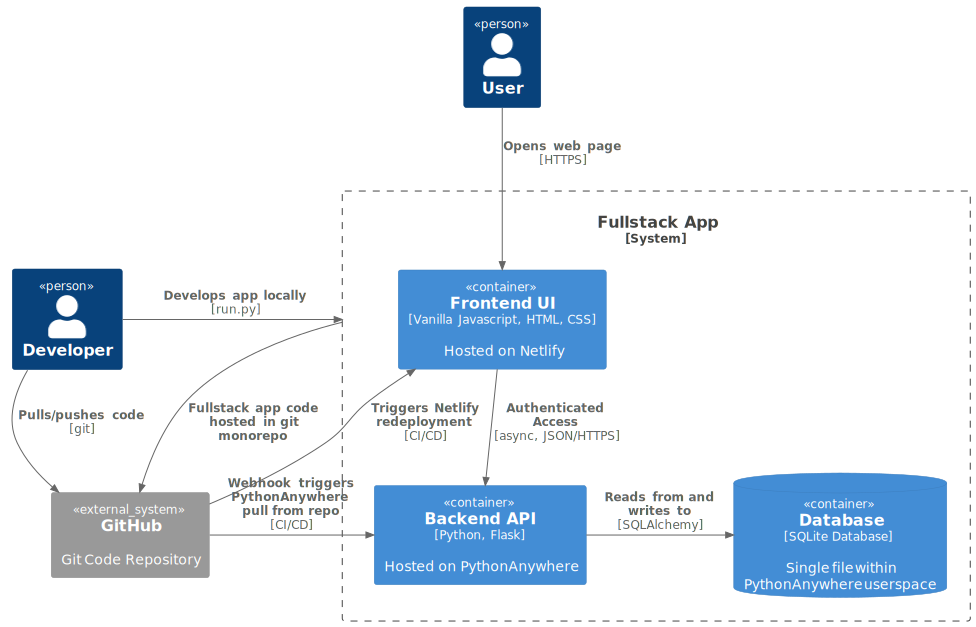

# fullstack

## Description

A **full-stack** web application includes:

- a front-end user interface;
- a back-end API;
- a database;
- the systems and services keeping those running;
- and the repository of code for all of these components.

Even a simple app therefore involves several technological pieces:

- HTML, CSS, and Javascript for the front-end;
- a programming language of your choice (let's choose [Python](https://xkcd.com/353/)) for the backend;
- SQL for the database;
- some shell scripting (probably Bash, maybe a bit of Python) to get everything in place and running on its system;
- and Git for version control.

The aim of this project is to set up those essential pieces, so that
at the next [hackathon](https://kingdomcode.org.uk/build/) we can
quickly get started with making an app that would be useful to the
world, and help foodbanks manage their stock, churches share their
sermons, book-lovers catalogue their shelves, people pray for their
neighbourhoods -- and whatever else.

## Diagram



## Development

If you're a developer, then you can clone this repo and get started:

```
git clone https://github.com/peterprescott/fullstack
cd fullstack
conda create --name fs_env python=3.10
conda activate fs_env
cd py_setup
pip install -r requirements.txt
cd ..
python run.py
```

That run script should set up two threads: one to serve a front-end user
interface at [localhost:8000](http://localhost:8000), and the other to
run a back-end API at [localhost:5000](http://localhost:5000).

## Deployment

While you're getting that working, you should also be able to find a
working demo of the app [here](https://fullstack.me.uk/), with
frontend hosted for free by [Netlify](https://netlify.com), backend
hosted for free by [PythonAnywhere](https://pythonanywhere.com), and
both immediately updated whenever new code is merged to the `main`
branch of this [Github](https://github.com) repo.

You can deploy your own fork of this to Netlify, just by clicking here:

[](https://app.netlify.com/start/deploy?repository=https://github.com/peterprescott/fullstack)

And then to get things running on PythonAnywhere, just [register for a
new
account](https://www.pythonanywhere.com/registration/register/beginner/),
go to the **Web** tab, and **Add a new web app**. For your free account,
the app will be served at your $USERNAME.pythonanywhere.com, so confirm
that's fine, then select **Flask** as your Python web framework, and
**Python 3.10** as your Python version, and accept the default filepath
for your new Flask web app. You should now be able to navigate to
$USERNAME.pythonanywhere.com and see a simple message saying "Hello
from Flask!" Now go to the **Consoles** tab of your PythonAnywhere
dashboard and open a Bash console:

```
# move to the /var/www directory
cd /var/www

# clone the fullstack git repository
git clone https://github.com/peterprescott/fullstack

# move into the repo directory
cd fullstack

# and run the PythonAnywhere setup script
./python_anywhere.py
```

The script will rewrite the WSGI script in `/var/www` with one that
imports the fullstack_api application; install the necessary packages
listed in `py_setup/dependencies.freeze`; and generate a random
SECRET_KEY to be saved in `fullstack_api/secret.py`.

You then just need to go to the PythonAnywhere Web tab, and click the
green button to reload your app, and now if you go to $USERNAME.pythonnanywhere.com, you should see some
JSON greeting you with the `message` 'Hello, World!' (or whatever has
been defined by the `fullstack_api.app` code.
